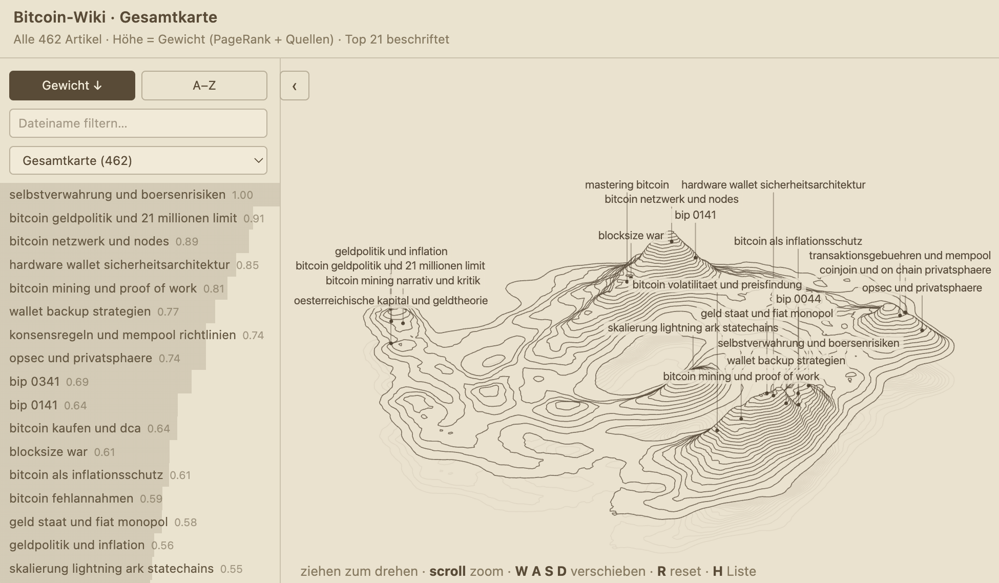
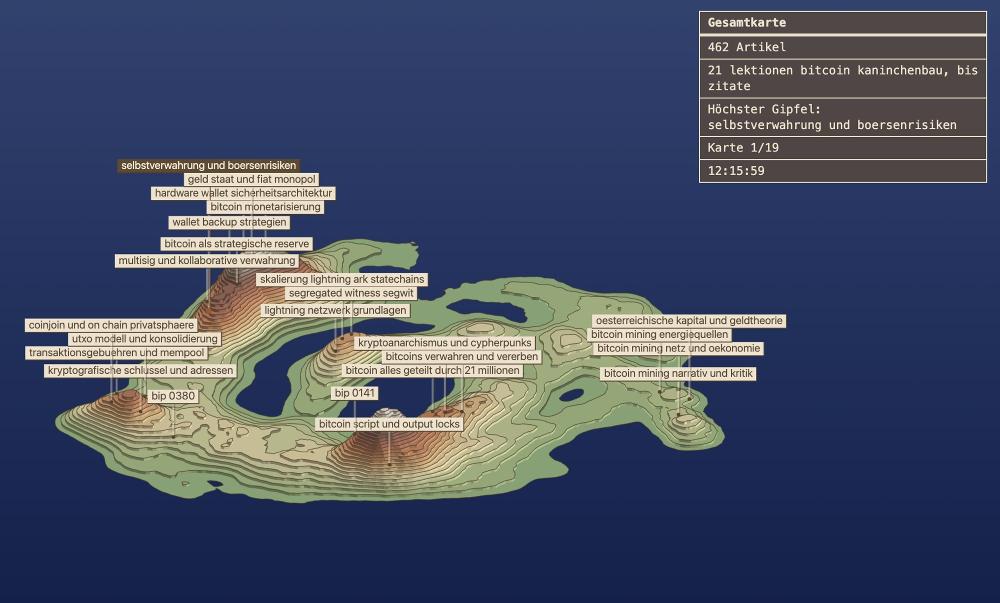

```
██████╗ ██╗████████╗ ██████╗ ██████╗ ██╗███╗   ██╗
██╔══██╗██║╚══██╔══╝██╔════╝██╔═══██╗██║████╗  ██║
██████╔╝██║   ██║   ██║     ██║   ██║██║██╔██╗ ██║
██╔══██╗██║   ██║   ██║     ██║   ██║██║██║╚██╗██║
██████╔╝██║   ██║   ╚██████╗╚██████╔╝██║██║ ╚████║
╚═════╝ ╚═╝   ╚═╝    ╚═════╝ ╚═════╝ ╚═╝╚═╝  ╚═══╝

██╗    ██╗         ██╗        ██╗  ██╗         ██╗
██║    ██║         ██║        ██║ ██╔╝         ██║
██║ █╗ ██║         ██║        █████╔╝          ██║
██║███╗██║         ██║        ██╔═██╗          ██║
╚███╔███╔╝         ██║        ██║  ██╗         ██║
 ╚══╝╚══╝          ╚═╝        ╚═╝  ╚═╝         ╚═╝
```

# Bitcoin Knowledge Base

Ein persönliches Second Brain zu Bitcoin: ein Wiki aus verlinkten Artikeln und BIP-Zusammenfassungen, das mit jeder neuen Quelle wächst. Aufgebaut nach dem [LLM-Knowledge-Base-Muster von Andrej Karpathy](https://youtu.be/ib74sLgjIBM), mit Claude als Bibliothekar.

## Die Karte

Das Wiki ist als begehbare 3D-Höhenkarte veröffentlicht. Jeder Artikel ist ein Hügel, seine Höhe folgt dem Gewicht im Backlink-Graphen.

**https://tlausz.github.io/Bitcoin-Knowledge-Base-WIKI/**



Ein Klick auf einen Gipfel öffnet den Artikel im Lesefenster. Ein `#slug` in der URL springt direkt dorthin, zum Beispiel [`#bip-0110`](https://tlausz.github.io/Bitcoin-Knowledge-Base-WIKI/#bip-0110); der Slug ist der Dateiname im Wiki.

Neben der Gesamtkarte gibt es achtzehn Themenkarten, je eine pro Themenbereich, erreichbar über das Menü der Karte oder unter `themen/<thema>.html`, etwa [Self-Custody](https://tlausz.github.io/Bitcoin-Knowledge-Base-WIKI/themen/self-custody.html) oder [Lightning](https://tlausz.github.io/Bitcoin-Knowledge-Base-WIKI/themen/lightning.html).

## Was drin ist

Stand: September 2026.

| Inhalt | Anzahl |
|---|---|
| Artikel gesamt | 462 |
| davon Themenartikel | 252 |
| darunter Buchartikel | 32 |
| darunter Studienartikel | 13 |
| davon BIP-Zusammenfassungen (BIP-0001 bis BIP-0459) | 210 |
| Themenbereiche und Themenkarten | 18 |
| Eingelesene Quellen (lokal, nicht im Repo) | rund 1'360 |

Jeder Artikel trägt ein oder mehrere von achtzehn Themen, im Schnitt zwei. Die Summen liegen deshalb über der Artikelzahl und der Gesamtgrösse des Wikis. Die Textmenge zeigt, dass die Artikelzahl allein wenig sagt: die 211 BIP-Artikel sind zusammen kleiner als die 57 Adoptions-Artikel.

| Thema | Artikel | Text | Thema | Artikel | Text |
|---|---|---|---|---|---|
| Ökonomie | 103 | 992 KB | Lightning | 45 | 240 KB |
| Protokoll | 103 | 761 KB | Geschichte | 23 | 237 KB |
| Adoption | 57 | 588 KB | Grundlagen | 27 | 235 KB |
| Philosophie | 68 | 533 KB | Bücher | 32 | 199 KB |
| Mining | 53 | 482 KB | Studien | 13 | 179 KB |
| Self-Custody | 92 | 459 KB | Wallets | 23 | 149 KB |
| BIPs | 211 | 353 KB | Satoshi | 8 | 91 KB |
| Privacy | 67 | 353 KB | Glossar | 4 | 49 KB |
| Kritik | 23 | 265 KB | Zitate | 2 | 31 KB |

- **Grundlagen**: Transaktionen, Blöcke, Schlüssel und Adressen.
- **Protokoll**: UTXO-Modell, Script, SegWit, Taproot, Mempool, Soft Forks.
- **BIPs**: jedes Bitcoin Improvement Proposal in einem eigenen Artikel mit Status, Kernidee und offenen Fragen.
- **Self-Custody**: Hardware-Wallets, Seed-Phrasen, Multisig, Backups und Vererbung.
- **Wallets**: die konkrete Software zur Selbstverwahrung.
- **Privacy**: CoinJoin, Silent Payments, Adresswiederverwendung, Chain-Analyse und Opsec.
- **Mining**: Proof of Work, Hashrate, Mining-Ökonomie und die Energiefrage.
- **Lightning**: von Kanälen und Routing bis zu Splicing und Privatsphäre im Netzwerk.
- **Ökonomie**: Geldtheorie, Knappheit, Inflation, Österreichische Schule, Stablecoins und Regulierung.
- **Philosophie**: warum Bitcoin so gebaut ist, wie es ist.
- **Adoption**: Länder, Institutionen, ETFs und Gesetze wie der Clarity Act.
- **Kritik**: die Gegenargumente samt Prüfung.
- **Geschichte** und **Satoshi**: die Frühzeit von den Cypherpunks bis zum Blocksize War.
- **Bücher**: Standardwerke von «Mastering Bitcoin» bis «Der Fiat-Standard», in eigenen Worten zusammengefasst.
- **Studien**: akademische Arbeiten, darunter Adoptionsstudien für die Schweiz und den DACH-Raum sowie begutachtete Arbeiten zu Mining, Stromnetzen und Methan; vollständige Liste auf der [Themenkarte Studien](https://tlausz.github.io/Bitcoin-Knowledge-Base-WIKI/themen/studien.html).
- **Glossar** und **Zitate**.

## Aufbau eines Artikels

Themenartikel sind in Schweizer Hochdeutsch geschrieben, auch wenn die Quelle englisch ist. BIP-Artikel sind englisch. Jeder Artikel folgt demselben Schema: ein Status (**established**, **emerging** oder **speculative**) sagt, wie belastbar der Inhalt ist; dann Quellen, eine Zusammenfassung in wenigen Sätzen, der Hauptteil, verwandte Artikel und offene Fragen. Jede Aussage im Wiki geht auf eine konkrete Quelldatei zurück. Was keine Quelle hat, wird als speculative markiert oder in `Wiki/QUESTIONS.md` geparkt.

## Wie es entsteht

Quellen wie Artikel, Podcast-Transkripte, Papers und Bücher landen unverändert in einem lokalen `RAW/`-Ordner. Claude liest sie, destilliert sie in neue oder bestehende Wiki-Artikel, setzt die Backlinks, aktualisiert den Index und ordnet die Themen zu; danach werden Karte und Themenkarten neu gebaut. Ein monatlicher Health Check prüft das Wiki auf Schreibregeln, tote Links und Artikel, die von emerging auf established gehoben werden können.

Der `RAW/`-Ordner ist nicht Teil dieses Repos. Er enthält urheberrechtlich geschütztes Material und bleibt lokal; veröffentlicht wird nur das kompilierte Wiki.

## Screensaver

Die Karte ist zugleich ein Bildschirmschoner: eine langsame Umrundung der Insel im Wechsel mit Tiefflügen, die Höhenlinien nach Höhe eingefärbt. Er startet auf der Live-Karte nach 42 Sekunden ohne Eingabe oder direkt unter [screensaver.html?noexit=1](https://tlausz.github.io/Bitcoin-Knowledge-Base-WIKI/screensaver.html?noexit=1).



Details zu Aufbau und Bedienung in [`Visualizer/`](Visualizer/).

## Nutzung in Obsidian

Repo klonen oder herunterladen und den Ordner `bitcoin_kb` als Vault öffnen. Die Graph-Ansicht (`Cmd/Ctrl + G`) zeigt das Backlink-Netz aller Artikel; dichte Cluster markieren, wo sich Konzepte überschneiden. Einstieg über `Wiki/INDEX.md` mit der vollständigen Artikelliste, offene Fäden in `Wiki/QUESTIONS.md`.

Mit dem Plugin Dataview lassen sich Artikel nach Status abfragen, etwa alle spekulativen:

````
```dataview
LIST FROM "Wiki" WHERE contains(status, "speculative")
```
````

Das Wiki ist reines Markdown. Es lässt sich in jedem Editor lesen; die `[[Backlinks]]` sind Obsidian-Syntax, funktionieren anderswo aber als gewöhnliche Artikelverweise.

---

*Work in progress. Artikel kommen dazu, sobald neue Quellen eingelesen sind.*

Die Quellen sind von Hand ausgewählt, die Artikel hat eine AI geschrieben. AI macht Fehler: Zahlen, Daten und Zuschreibungen können falsch sein, Zusammenhänge verkürzt, einzelne Aussagen erfunden. Kein Anspruch auf Vollständigkeit. Vor jeder Entscheidung, die auf einem Artikel beruht, die angegebene Quelle prüfen. Don't trust, verify.

Das Wiki steht unter der Lizenz [CC BY 4.0](https://creativecommons.org/licenses/by/4.0/).

Gebaut mit [Claude](https://claude.ai) · Muster von [Andrej Karpathy](https://youtu.be/ib74sLgjIBM)
