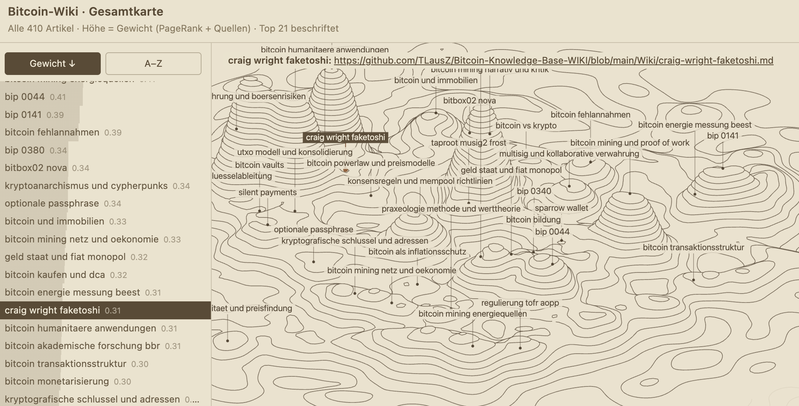
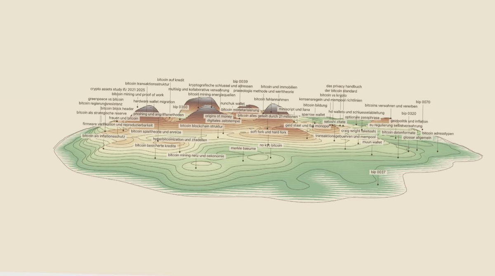

# Visualizer

**Live-Demo: https://tlausz.github.io/Bitcoin-Knowledge-Base-WIKI/**

Interaktive 3D-Konturkarten der Wiki-Artikel. Jeder Artikel ist ein Hügel;
die Höhe entspricht seinem Gewicht aus `tools/rank_articles.py`
(0.7 · PageRank im Backlink-Graph + 0.3 · log-normierte RAW-Quellenzahl).



Alles sind einzelne HTML-Dateien ohne Abhängigkeiten — Doppelklick genügt.
Rendering: Canvas 2D mit eigener orthografischer Projektion und
Marching-Squares-Konturen, kein WebGL.

## Dateien

| Datei | Inhalt |
|---|---|
| `index.html` | Gesamtkarte: alle Artikel (Stand 2026-07-11: 410), Positionen force-directed aus dem Backlink-Graphen — verlinkte Artikel liegen beieinander, thematische Cluster werden zu Gebirgszügen. |
| `wiki-topographie.html` | Kompakte Karte der Top-14-Artikel, jeder Gipfel beschriftet. |
| `kontur-demo.html` | Ursprünglicher Prototyp mit Zufallsterrain. Leertaste würfelt neu. |
| `screensaver.html` | Screensaver der Gesamtkarte, siehe eigener Abschnitt unten. |
| `SCREENSAVER.md` | Technische Doku zum Screensaver. |
| `wiki-map-screenshot.png` | Screenshot der Gesamtkarte für diese README. |
| `screensaver-screenshot.jpg` | Screenshot des Screensavers für die READMEs. |

## Screensaver

Die Gesamtkarte als Bildschirmschoner: ein langsamer Orbit um die Insel im
Wechsel mit Überflügen in Ego-Perspektive, die Höhenringe nach Höhe
eingefärbt (Atlas-Palette: Grün → Gelb → Ocker → Rostbraun → Grau → Weiss).
Auf der Live-Demo startet er von selbst nach 42 s ohne Eingabe; jede
Mausbewegung, Taste oder Berührung führt zurück zur Karte.



**Direkt öffnen (alle Parameter auf Defaultwerten):
https://tlausz.github.io/Bitcoin-Knowledge-Base-WIKI/screensaver.html?noexit=1&pal=1&speed=1&labels=84**

`mode` und `zoom` fehlen im Link bewusst: sie haben keinen neutralen Wert —
sobald sie gesetzt sind, fixieren sie den Modus bzw. frieren den Zoom ein.
Weglassen bedeutet Wechsel-Zyklus und atmender Zoom (das Default-Verhalten).

URL-Parameter (kombinierbar mit `&`):

| Parameter | Wirkung |
|---|---|
| `noexit=1` | Exit-Events aus — die Seite bleibt trotz Mausbewegung offen |
| `pal=1…5` | Palette umschalten: 1 Atlas-Klassiker (Standard), 2 sonnig, 3 kühl, 4 sepia-nah, 5 hypsometrisch |
| `mode=flug` / `mode=orbit` | Modus fixieren statt Wechsel-Zyklus |
| `speed=N` | Zeitraffer, z. B. `speed=8` zum Testen |
| `labels=N` | Label-Maximum im Flugmodus (Standard 84) |
| `zoom=N` | friert den Orbit-Zoom auf N ein (Standard: langsames Atmen 1.10–3.40) |

Technische Details — Renderer, Timeline, Höhenfärbung, Entscheidungen —
in [`SCREENSAVER.md`](SCREENSAVER.md).

## Bedienung der Gesamtkarte

| Eingabe | Wirkung |
|---|---|
| Ziehen mit der Maus | dreht (horizontal) und kippt (vertikal) |
| Scrollrad | Zoom, Faktor 0.4 bis 8 |
| `W` `A` `S` `D` | verschiebt den Kartenausschnitt (flüssig, Tasten kombinierbar) |
| `R` | setzt Drehung, Kippwinkel, Zoom und Verschiebung zurück |
| Klick auf ein Label (Karte oder Liste) | wählt den Artikel aus, nochmal klicken wählt ab |

Das Gelände ist ein fester Körper: pro Höhenstufe werden Wand und Deckel
deckend gefüllt, rückseitige Linien verschwinden dahinter wie bei einem
Stufenmodell. Der Schatten auf der Bodenebene bleibt nur am vorderen Rand
sichtbar.

### Labels und Auswahl

Beschriftet sind immer die gewichtigsten Artikel im sichtbaren Ausschnitt
(`LABEL_TOP`, aktuell 21 — wie die 21 Millionen). Beim Hineinzoomen wächst
das Label-Budget quadratisch mit, bei Maximal-Zoom sind alle sichtbaren
Artikel beschriftet. Gipfel, die hinter Bergen liegen, bekommen kein Label
(Sehstrahl-Test gegen das Höhenfeld).

Das linke Panel listet alle Artikel, sortierbar nach Gewicht ↓/↑ oder
A–Z/Z–A; der Hintergrundbalken jeder Zeile zeigt das Gewicht. Hover in der
Liste oder auf einem Karten-Label hebt den Hügel hervor. Bei Auswahl
erscheint oben im Kartenbereich Name und GitHub-URL des Artikels; die URL
öffnet die Wiki-Seite in einem neuen Fenster. Die Basis-URL steckt als
Konstante `WIKI_URL` im HTML und als `url`-Spalte in `Outputs/ranking.csv`.

### Deep-Links auf einzelne Artikel

Ein `#slug` an der URL öffnet den Artikel beim Laden direkt im Lese-Modal
und markiert ihn auf Karte und Liste. Der Slug ist der Dateiname des
Wiki-Artikels, z. B.
[…/index.html#bip-0110](https://tlausz.github.io/Bitcoin-Knowledge-Base-WIKI/#bip-0110).
Beim Öffnen eines Artikels schreibt die Karte den Hash selbst in die
Adresszeile — anklicken, URL kopieren, weitergeben. Ein unbekannter Slug
wird ignoriert; auf Themenkarten (`themen/*.html`) greift der Link nur, wenn
der Artikel dort vorkommt.

## Determinismus

Beide Wiki-Karten sind deterministisch: Terrain-Rauschen und Layout laufen
mit festem Seed, dieselben Daten ergeben also bei jedem Laden exakt
dieselbe Karte. Andere Terrain-Variante: Seed in `buildField()` ändern
(`let s=21`); anderes Layout: `SEED` in `tools/layout_map.py`.

## Daten aktualisieren

Die Artikeldaten (Name, Score, Position) sind als `PEAKS`-Konstante in die
HTML-Dateien eingebettet. Nach größeren Wiki-Änderungen neu erzeugen:

```
python3 tools/rank_articles.py --csv Outputs/ranking.csv
python3 tools/layout_map.py
```

`layout_map.py` liest den `[[Backlink]]`-Graphen aus `Wiki/`, rechnet ein
Fruchterman-Reingold-Layout (verlinkte Artikel ziehen sich an, fester Seed,
Mindestabstand zwischen Gipfeln) und ersetzt die `PEAKS`-Konstante in der
Gesamtkarte. Nähe auf der Karte bedeutet dort also Linkstruktur.
Artikelzahl und Label-Anzahl im Untertitel der Karte werden zur Laufzeit
aus den Daten erzeugt und müssen nicht gepflegt werden.
`wiki-topographie.html` (Top 14) nutzt weiterhin die einfache
Goldener-Winkel-Spirale nach Ranking; ihre `PEAKS`-Liste wird nicht von
`layout_map.py` aktualisiert.

Screenshot neu erzeugen (headless Chrome, aus diesem Ordner):

```
"/Applications/Google Chrome.app/Contents/MacOS/Google Chrome" \
  --headless=new --disable-gpu --hide-scrollbars \
  --screenshot=wiki-map-screenshot.png --window-size=1600,1000 \
  --virtual-time-budget=4000 "file://$(pwd)/index.html"
```

## Stellschrauben (im Quelltext)

- `SIG` / `SKIRT` — Breite von Gipfel und Sockel; SKIRT verbindet Nachbarhügel zu Graten
- `waves`-Schleife — Anzahl und Amplitude der Rausch-Oktaven (Zackigkeit der Linien)
- `L` — Anzahl Höhenlinien
- `LABEL_TOP` — Label-Budget in der Startansicht (nur Gesamtkarte)
- `ZOOM0` — Zoom beim Laden und nach `R`
- `WIKI_URL` — Basis-URL für die Artikel-Links
