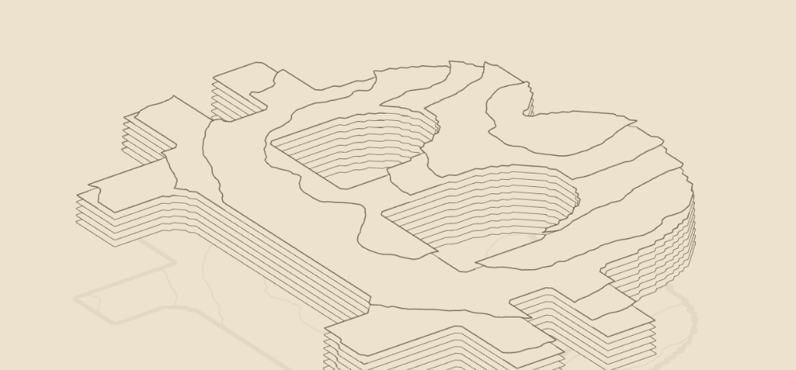

# Bitcoin ₿ · Höhenrelief

Kleine Spielwiese: ein drehbares Bitcoin-₿ als topografisches Höhenrelief, komplett in einer HTML-Datei mit purem Canvas-2D, ohne externe Abhängigkeiten. Die Silhouette kommt aus einem Logo-PNG, die Oberfläche aus fraktalem FFT-Terrain, gezeichnet als gestapelte Höhenlinien.



## Stilvorlage

Ausgangspunkt war dieses AI-generierte Bild als Zielbild — ein ₿ aus scharf gestapelten Höhenlinien mit feiner Terrassen-Struktur. Der Canvas-Nachbau oben nähert sich diesem Look an; irgendwann soll er im Wiki-Projekt landen.


## Starten

Die zwei Logo-PNGs werden relativ geladen, darum braucht es einen lokalen Server (nicht per `file://`). Im übergeordneten `Visualizer/`-Ordner:

```
python3 -m http.server 8123
```

Dann `http://localhost:8123/bitcoin-3d-wip/bitcoin-3D.html` öffnen.

## Steuerung

- **Ziehen** – drehen (Yaw) und kippen (Pitch)
- **Scroll** – Zoom
- **W A S D** – verschieben
- **N** – nächster Seed (neue Zufallskarte)
- **R** – Ansicht zurücksetzen
- **Kante-Button** – zykelt durch `scharf → weich → Kreis`. «Kreis» ersetzt das ₿ durch eine volle Scheibe, so sieht man das ganze Terrain eines Seeds ohne die ₿-Maskierung.

## Regler

| Regler | Was er tut |
|---|---|
| Seed | Zufalls-Startwert des Terrains |
| β Rauheit | Spektral-Exponent, höher = glatter/rolliger |
| Höhenlinien | Anzahl der Konturebenen |
| Boden-Schnitt | Untere Ebenen weglassen; die erste sichtbare wird der Sockel |
| Max-Höhe | Maximale Höhe der Skulptur |
| Sockel (Klippe) | Höhe der senkrechten ₿-Kante, bevor oben das Terrain draufkommt |
| Höhenzug oben | Wie stark das FFT-Terrain auf dem Sockel aufträgt |
| Logo-Skala | Grösse des ₿ bzw. der Kreisscheibe |
| Schwebehöhe | Hebt/senkt die (immer gegroundete) Basis; -1 = auf der Schattenebene |

## Pipeline

Der Ablauf im Code (`bitcoin-3D.html`), von Rohdaten zum Bild:

1. **FFT-Terrain** (`computeField`) – weisses Rauschen → 2D-FFT → Spektrum mit `1/f^β` filtern → inverse FFT → fraktales Höhenfeld.
2. **Logo-Maske** (`loadLogo`) – das ₿ (oder die Scheibe) wird zur Luminanz-Maske; nur innerhalb steigt das Terrain an, aussen bleibt es 0 → senkrechte Silhouette.
3. **Höhenlinien** (`contour` + `chainLoops`) – Marching Squares zieht pro Ebene geschlossene Ringe.
4. **Render** (`draw`) – pro Ring Wand + Deckel, von unten nach oben; Löcher im ₿ werden per `evenodd`-Füllung ausgestanzt; darunter ein blasser Schatten.
5. **Projektion** (`project`) – orthografisch, Yaw als Drehteller, Pitch als Kippwinkel.

## FFT-Terrain (Frequenzsynthese)

Das Gelände entsteht nicht per Perlin/Simplex-Noise, sondern per **Frequenzsynthese** nach Paul Bourke ([paulbourke.net/fractals/noise](https://paulbourke.net/fractals/noise/)). Die Idee: fraktales Rauschen hat ein Potenzgesetz-Spektrum, also baut man es direkt im Frequenzraum.

Ablauf in `computeField`:

1. **Weisses Rauschen** – ein `N×N`-Feld aus Zufallswerten füllen. Der Seed kommt aus `mulberry32`, darum ist jede Karte reproduzierbar.
2. **Vorwärts-FFT** – `fft2d` (inline, radix-2) transformiert das Rauschen in den Frequenzraum. Weisses Rauschen hat dort ein flaches Spektrum (alle Frequenzen gleich stark).
3. **Spektrum färben** – jede Frequenz `f` (radialer Abstand vom Ursprung) wird mit `f^(-β/2)` skaliert. Damit fällt das Leistungsspektrum wie `1/f^β` ab, das Kennzeichen fraktalen Rauschens. Der Gleichanteil (`f = 0`) wird auf 0 gesetzt, das entfernt den konstanten Offset.
4. **Rück-FFT** – zurück in den Ortsraum; der Realteil ist das Höhenfeld, danach auf `0..1` normiert.

Der Regler **β** ist der Spektral-Exponent:

- **hohes β** dämpft hohe Frequenzen stark → wenig Detail, weiche, rollige Hügel.
- **tiefes β** lässt hohe Frequenzen stehen → zerklüftetes, raues Gelände.

## Status

Work in Progress, Sandbox. Offen: die Logo-PNGs als Data-URI einbetten, damit die Datei ohne Server und ausserhalb dieses Ordners läuft. Vorlage für den Look ist der Wiki-Kartenvisualizer eine Ebene höher (`../index.html`).
